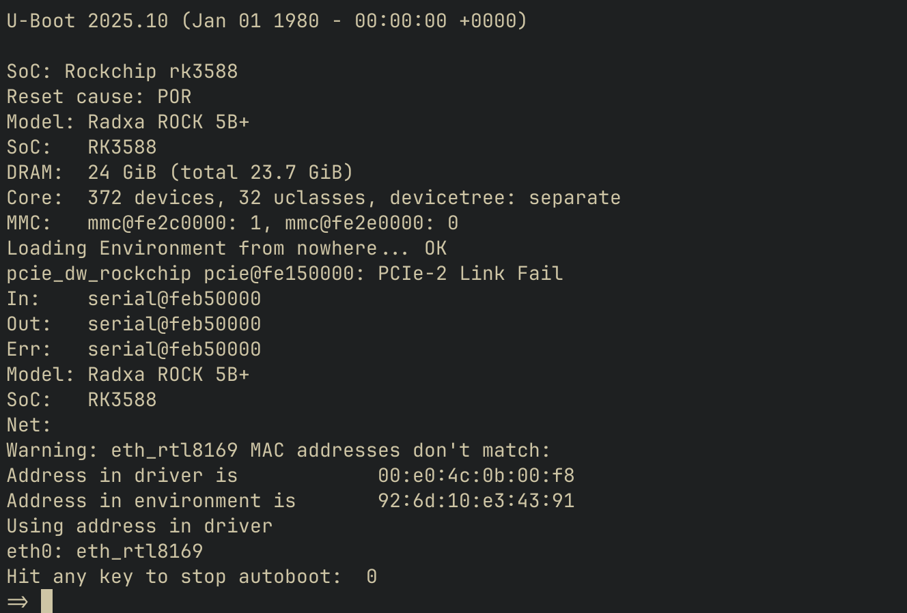

# RK3588 (Rock 5B) Firmware – Nix Flake

Minimal, reproducible builds for Rock 5B firmware components:

* **tf-a** — ARM Trusted Firmware-A (BL31)
* **rkbin** — Rockchip DDR/TPL blobs & tools
* **uboot** — U-Boot for Rock 5B integrated with TF-A + rkbin

> **Why this exists**: Stock U-Boot couldn't WGET FIT images or auto-detect my NIC on boot. So naturally, I built this Nix flake. 🚀 (Also, figuring out the build process was hella irritating, so now you don't have to.)

Builds for Linux/ARM64 (tf-a, uboot) and Linux/x86_64 (rkbin); macOS aliases to Linux outputs and offloads to remote builders.



---

## Features ✨

* **Network Boot**: WGET support for HTTP-based FIT image loading
* **Netconsole**: Remote serial console access over UDP
* **Persistent Environment**: SPI flash storage with redundancy for saveenv
* **Dual Console Access**: Serial and netconsole work simultaneously for redundant access

---

## Requirements

* Nix with Flakes enabled
* Remote builders: `aarch64-linux` (tf-a, uboot) and `x86_64-linux` (rkbin)

Configuring Nix remote builders is beyond the scope of this document. See the [Nix manual](https://nixos.org/manual/nix/stable/advanced-topics/distributed-builds.html) for details.

**Note**: This repo includes the latest pre-built binaries in `firmware/`, so you can skip building entirely if you just want to flash the firmware.

📌 **Important**: TF-A must be built with GCC 11 for proper multi-CPU initialization on RK3588. Newer GCC versions break CPU initialization. This is correctly configured in `pkgs/tf-a.nix`.

---

## Quick start

### Build

```bash
# Build all required components in one command
nix build .#tf-a .#rkbin .#uboot

# Outputs
ls result*
```

**Files needed for flashing**: `result-1/rk3588_spl_loader_v1.19.113.bin` (rkbin) and `result-2/u-boot-rockchip-spi.bin` (uboot)

### Flash

Put the Rock 5B into Maskrom mode, then use [rkdeveloptool](https://github.com/rockchip-linux/rkdeveloptool):

```bash
# List devices (verify Maskrom mode)
sudo ./rkdeveloptool ld
# DevNo=1 Vid=0x2207,Pid=0x350b,LocationID=103    Maskrom

# Clear SPI (only needed after failed flash)
sudo ./rkdeveloptool ef

# Option 1: Using pre-built binaries (no Nix required)
sudo ./rkdeveloptool db firmware/rk3588_spl_loader_v1.19.113.bin
sudo ./rkdeveloptool wl 0 firmware/u-boot-rockchip-spi.bin

# Option 2: Using Nix build outputs
sudo ./rkdeveloptool db result-1/rk3588_spl_loader_v1.19.113.bin
sudo ./rkdeveloptool wl 0 result-2/u-boot-rockchip-spi.bin

# Reset device (reboot to normal mode)
sudo ./rkdeveloptool rd
```

---

## Configuration

### Build-Time Configuration (pkgs/uboot.nix)

These settings are compiled into the U-Boot binary and require rebuilding to change:

**Network Boot:**
- `CONFIG_CMD_WGET=y` - HTTP/HTTPS download support
- `CONFIG_PCI_INIT_R=y` - PCI/NIC initialization
- `CONFIG_PROT_TCP_SACK=y` - TCP selective acknowledgment
- `CONFIG_BOOTDELAY=10` - 10 second boot delay

**Netconsole Support:**
- `CONFIG_NETCONSOLE=y` - UDP-based remote console
- `CONFIG_CONSOLE_MUX=y` - Multiple console devices simultaneously
- `CONFIG_SYS_CONSOLE_IS_IN_ENV=y` - Runtime console configuration
- `CONFIG_ENV_OVERWRITE=y` - Allow overwriting console variables

**Environment Storage:**
- `CONFIG_ENV_IS_IN_SPI_FLASH=y` - Store environment in SPI flash
- `CONFIG_SYS_REDUNDAND_ENVIRONMENT=y` - Redundant storage for safety
- Environment at 0x3f0000, redundant at 0x3f8000 (32KB each)

**Default Boot Sequence:**
- PREBOOT: `setenv autoload no; setenv serverip <ip>; setenv httpdstp 8080; setenv fit /rock5b.fit`
- BOOTCOMMAND: `dhcp; wget 0x60000000 ${fit}; bootm`

To add custom build options, append to the config in `pkgs/uboot.nix`:

```nix
cat >> .config <<'EOF'
CONFIG_YOUR_OPTION=y
EOF
```

### Runtime Configuration (U-Boot Console)

These settings are configured at runtime and saved to SPI flash with `saveenv`:

**Network Settings:**
```bash
setenv ipaddr 192.168.1.70        # Static IP (or use dhcp)
setenv serverip 192.168.1.83      # HTTP server IP
setenv netmask 255.255.255.0
setenv gatewayip 192.168.1.1
setenv httpdstp 8080               # HTTP server port
```

**Boot Configuration:**
```bash
setenv fit /device-name.fit        # FIT image path
setenv bootdelay 5                 # Override default delay
```

**Netconsole (see Netconsole Setup section):**
```bash
setenv ncip 192.168.1.100:6667    # Netconsole host:port
setenv nc 'setenv stdout serial,nc; setenv stderr serial,nc; setenv stdin serial,nc'
```

Save changes:
```bash
saveenv
```

---

## Netconsole Setup

Access U-Boot console remotely over UDP. Useful for headless operation or debugging.

### Host Connection

Using socat (recommended):
```bash
socat -,raw,echo=0,icrnl,opost=1,onlcr,escape=0x1d UDP:<board-ip>:6667,bind=:6667
```
- Exit with `Ctrl+]`
- Replace `<board-ip>` with your Rock 5B's IP address
- Replace `6667` with the port you configured (if different)

### U-Boot Configuration

⚠️ **WARNING**: Test netconsole BEFORE making it automatic. Incorrect console settings can make the board difficult to access. Keep serial connection available during setup.

After first boot with network connectivity:

```bash
# 1. Set netconsole target (your host IP)
setenv ncip 192.168.1.100

# 2. Set netconsole ports (optional, defaults to 6666)
# Use different ports for multiple boards
setenv ncinport 6667   # incoming port (board listens on this)
setenv ncoutport 6667  # outgoing port (board sends to this on host)

# Alternatively, specify port directly in ncip
# setenv ncip 192.168.1.100:6667

# 3. Create netconsole enable command
setenv nc 'setenv stdout serial,nc; setenv stderr serial,nc; setenv stdin serial,nc'

# 4. TEST IT FIRST - make sure your socat connection works
run nc

# If it works, you should see output in socat
# If it doesn't work, reboot the board to restore serial-only console

# 5. Once tested and working, make it automatic on boot
setenv preboot 'dhcp; run nc'

# 6. Save configuration
saveenv
```

**Note**: Use different ports (6666, 6667, 6668, etc.) for multiple boards to avoid conflicts.

---

## Layout

```
flake.nix
pkgs/
  default.nix   # wires packages and toolchains
  tf-a.nix      # builds BL31 with git hash + date identifier
  rkbin.nix     # builds rkbin on x86_64-linux
  uboot.nix     # builds U-Boot with network boot + netconsole
```

---

## Acknowledgments 🙏

* [yrzr's Rock 5B U-Boot build notes](https://yrzr.github.io/notes-build-uboot-for-rock5b/#fn:6) for guidance on the build process
* [Collabora](https://www.collabora.com/) for their hardware enablement and U-Boot work on RK3588
